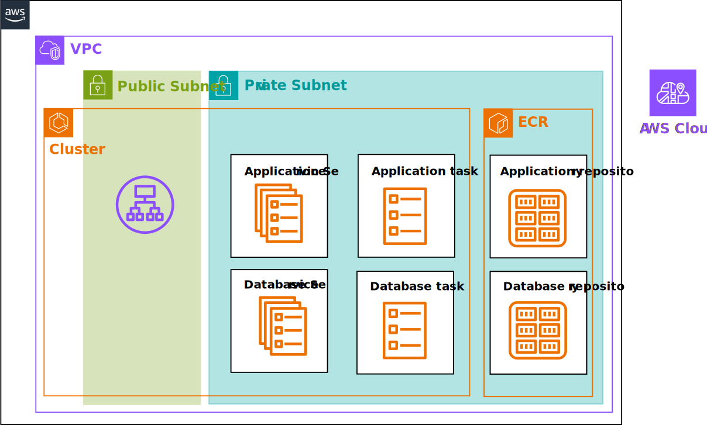

# Elastic Container Service (ECS) Stack

## Usage

1. Create a secret name `sylla-backend` in AWS Secret Manager with the following secrets.

| Key | Value |
| --- | --- |
| `DATABASE_USERNAME` | Username for database (e.g. postgres) |
| `DATABASE_PASSWORD` | Password for database (e.g. passw0rd) |
| `DATABASE_HOST` | `database.service.local` |
| `DATABASE_NAME` | Name of the database (e.g. sylla) |

2. We need to have two ECR repositories `backend` and `database`. Set the variables 
`ecr_arn` and `image` in `modules/backend/variables.tf` and `modules/database/variables.tf` 
respectively. The image cannot be from dockerhub, as it increase the risk of opening the 
database node to the public network. 

For the test purpose, we can use the following 
repository [mehr74/ecs-web-application-demo](https://github.com/mehr74/ecs-web-application-demo)

3. Add your public key to `main.tf` to allow ssh access to the EC2 instances.

## References 
* [How to Deploy an AWS ECS Cluster with Terraform](https://spacelift.io/blog/terraform-ecs)]